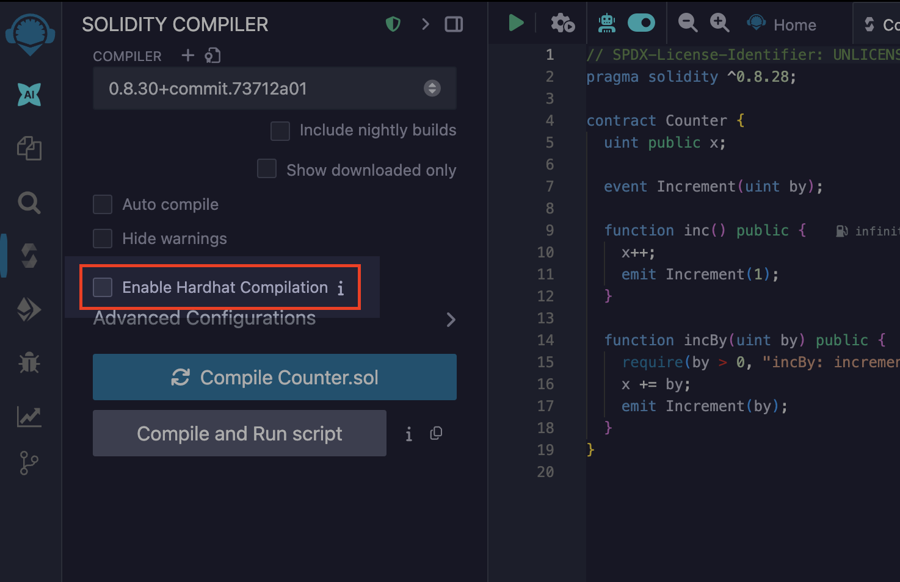

# Hardhat

Remix IDE has built-in support for [Hardhat](https://hardhat.org/), a popular Ethereum development environment for compiling, deploying, testing, and debugging Solidity smart contracts. Through Remix Desktop, Remix connects to your local Hardhat project, giving you access to Hardhat compilation, the Hardhat Provider for deploying to a local node, and Hardhat's `console.log` functionality.

## Enable Hardhat Compilation

### Prerequisites

To use Hardhat compilation with Remix Desktop efficiently:

1. **Hardhat** should be installed locally on the system [https://hardhat.org/getting-started/#installation](https://hardhat.org/getting-started/#installation).
2. The folder should be a Hardhat project containing `hardhat.config.js` or `hardhat.config.ts`.

### How to use

When you open a Hardhat project on Remix Desktop, there will be an extra checkbox in the `Solidity Compiler` plugin with the label `Enable Hardhat Compilation`.



There is an info icon alongside the label which redirects to a specific section of Remix official documentation that explains how to use Hardhat compilation.

Check the `Enable Hardhat Compilation` box to run the compilation for Hardhat along with Remix using the compiler configuration in the `Solidity Compiler` plugin.

On clicking the `Compile` button, a `remix-compiler.config.js` file will be created in the project root which stores the compiler configuration set in Remix's `Solidity Compiler` plugin. It is passed to Hardhat for compilation.

The result of the compilation will be shown in the Remix IDE terminal.


## Hardhat Provider

```{note}
In Hardhat, contracts are deployed by starting a local node. Read more about it in the [Hardhat documentation](https://hardhat.org/getting-started/#connecting-a-wallet-or-dapp-to-hardhat-network).
```

**Hardhat Provider** is a plugin on Remix IDE which enables users to deploy the contract to the Hardhat `localhost` network. This can be chosen from the `ENVIRONMENT` dropdown of the `Deploy and Run Transactions` plugin.


As soon as you select `Hardhat Provider`, a modal is opened asking for the `Hardhat JSON-RPC Endpoint`.


If the Hardhat node is running with default options, the default endpoint value in the modal will not need any change. If the Hardhat node host and port are different, the JSON-RPC endpoint should be updated in the modal text box.

Once the correct endpoint is filled in the modal, click `OK` and the accounts from the Hardhat node will be loaded in the `ACCOUNT` section. The network id will also be shown.


Now, you can start deploying the contract from Remix IDE to the Hardhat local node as usual.

## `console.log` in Remix IDE

Remix IDE supports the Hardhat console library while using `Remix VM`. It can be used while making a transaction or running unit tests.

### Deploy and Run Transactions

To try it out, you need to put an import statement and use `console.log` to print the value as shown in the image.


Further, once you execute the `changeOwner` method, the value from the console statement will be shown in the Remix terminal after the transaction details:


### Solidity Unit Testing

Similarly, `console.log` can be used while running unit tests using the Remix Solidity Unit Testing plugin.


For tests that include a logging message, the output will display in the Remix Terminal corresponding to the test name.


