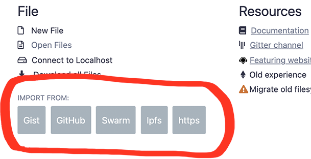
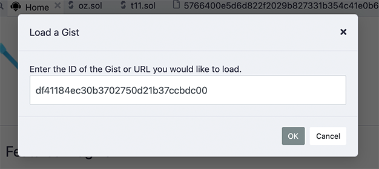

---
myst:
  html_meta:
    "description": "Import external libraries and dependencies into your Solidity contracts in Remix IDE from npm, GitHub, IPFS, or local files."
    "keywords": "solidity import, remix import, npm packages, GitHub imports, solidity dependencies"
---

# Importing & Loading Source Files in Solidity

There are two main reasons for loading external files into Remix:

- **to import a library or dependency** (for files you will NOT be editing)
- **to load some files for manipulation and editing** (for files you might want to edit)

## Importing a library or dependency

When importing from npm, or a URL (like GitHub, an IPFS gateway, or a Swarm gateway) you do not need to do anything more than use the `import` statement in your contract. The dependencies do not need to be "preloaded" into the File Explorer's current Workspace before the contract is compiled.

Files loaded from the import statement are placed in the **File Explorer's** current Workspace's `.deps` folder.

Under the hood, Remix checks to see if the files are already loaded in the **.deps** directory. If not, it gets them via unpkg if it is an npm lib.

Here are some example import statements:

### Import from npm

Use an npm package name directly in the import path. Remix resolves the package automatically via unpkg.

```Solidity
import "@openzeppelin/contracts/token/ERC20/ERC20.sol";
```

```Solidity
import "@openzeppelin/contracts@4.2.0/token/ERC20/ERC20.sol";
```

```{note}
In the scoped-package example above, **@openzeppelin** is the name of the npm library. In the following example the library's name does not begin with an @ - but Remix will go and check npm for a library of that name.
```

```Solidity
import "solidity-linked-list/contracts/StructuredLinkedList.sol";
```

### Import from a GitHub URL

Paste a full GitHub URL to import a file directly from a public repository.

```Solidity
import "https://github.com/OpenZeppelin/openzeppelin-contracts/blob/v2.5.0/contracts/math/SafeMath.sol";
```

You should specify the release tag (where available), otherwise you will get the latest code in the main branch. For OpenZeppelin Contracts you should only use code published in an official release, the example above imports from OpenZeppelin Contracts v2.5.0.

### Import from Swarm

Use a `bzz-raw://` URI to import a file stored on the Swarm decentralized storage network.

```Solidity
import 'bzz-raw://5766400e5d6d822f2029b827331b354c41e0b61f73440851dd0d06f603dd91e5';
```

### Import from IPFS

Use an `ipfs://` URI to import a file stored on the IPFS network.

```Solidity
import 'ipfs://Qmdyq9ZmWcaryd1mgGZ4PttRNctLGUSAMpPqufsk6uRMKh';
```

### Importing a local file not in .deps

To import a file NOT in the **.deps** folder, use a relative path (**./**). For example:

```Solidity
import "./myLovelyLovelyLib.sol";
```

```{warning}
Imports cannot reference files in a different Workspace. Both the contract and its dependencies must be in the same Workspace.
```

### Importing a file from your computer's filesystem

This method uses **Remix Desktop**, which has direct access to your computer's filesystem. Open the folder you want to work with from within the Remix Desktop app and its files will appear in the File Explorer.

### More about the import keyword

For a detailed explanation of the `import` keyword see the
[Solidity documentation](https://docs.soliditylang.org/en/latest/layout-of-source-files.html?highlight=import#importing-other-source-files)

## Importing files for manipulation

When importing from the home tab widgets or with a remix command in the console, the files are placed in the **root of the current Workspace** inside a folder that shows their source - eg GitHub or gists.

### Import buttons on the Remix home tab

The Gist, GitHub, Swarm, IPFS, & HTTPS buttons are to assist in getting files into Remix so you can explore.



Clicking on any of the Import buttons will bring up a modal like this one:



No need to wrap the URL or ID in quotes.

### Loading with a remix command in the console

The 2 remix commands for loading are:

- remix.loadurl(url)
- remix.loadgist(id)

```js
remix.loadurl('https://github.com/OpenZeppelin/openzeppelin-contracts/blob/v2.5.0/contracts/math/SafeMath.sol')
```

```js
remix.loadgist('5362adf2000afa4cbdd2c6d239e06bf5')
```

### Accessing files loaded from the Home tab or from a remix command

When you load from GitHub, a folder named `github` is created in the root of your current workspace. To import a file from the `github` folder, you would use a command like this:

```Solidity
import "github/OpenZeppelin/openzeppelin-contracts/contracts/math/SafeMath.sol";
```

Notice that this import statement doesn't include the version information that was in the remix.load(url) command. So it is recommended that you use the methods described at the top of this page for importing dependencies that you are not intending to edit.

Assume the .sol file that contained the import statement above is in the contracts folder. Notice that this import statement didn't need to traverse back to the `github` folder with a relative path like: `../github`.
