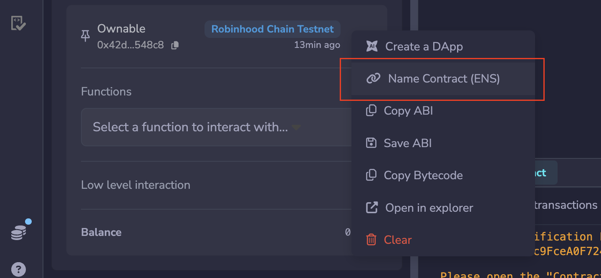
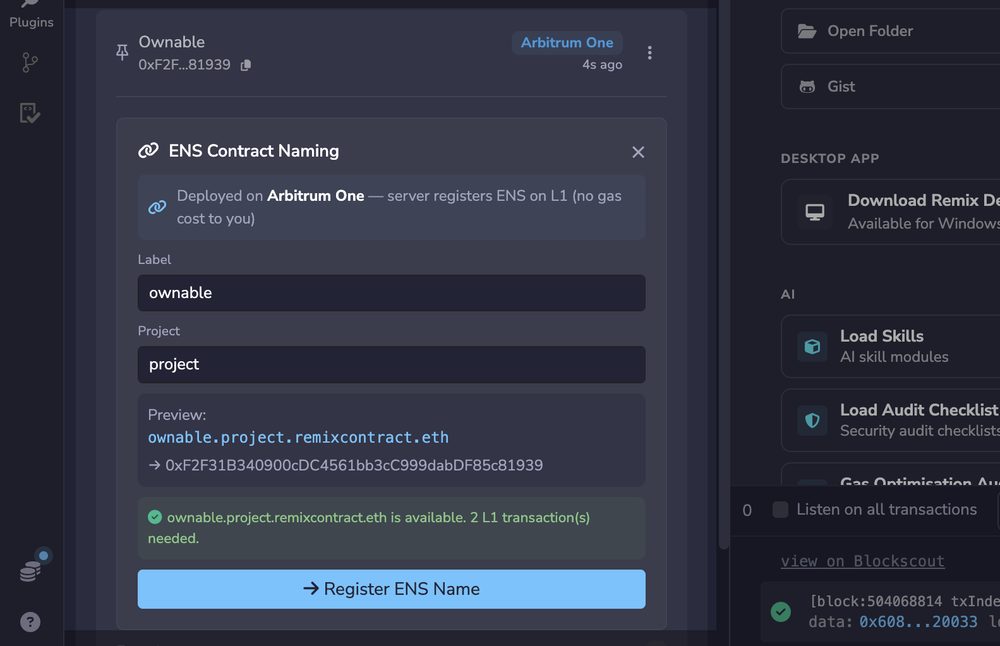
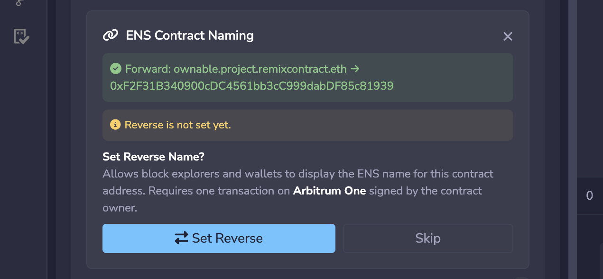
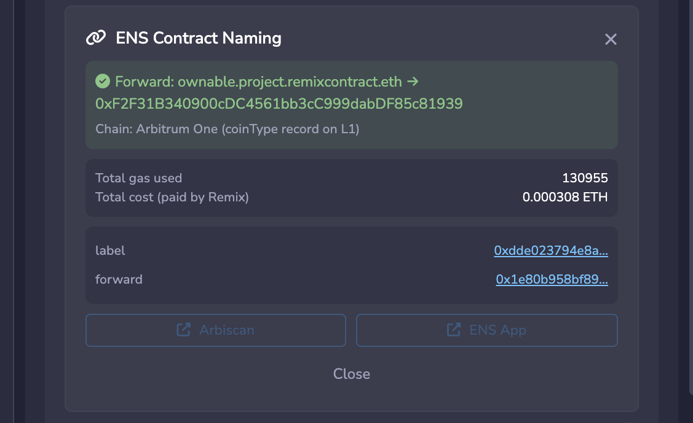

---
myst:
  html_meta:
    "description": "Give your deployed smart contract a human readable ENS name from inside Remix IDE."
    "keywords": "ens, contract naming, reverse name, remix ide, ownable, primary name"
---

# Naming Contracts

Giving your smart contract a human readable name closes a large security hole. Instead of asking people to trust a raw address, you give them a name they can read and verify. Remix now implements this ENS feature, so you can name a contract without leaving the IDE.

For background on the ENS side of this, see [Naming contracts](https://docs.ens.domains/web/naming-contracts) in the ENS documentation.

## Before you start

The contract you want to name has to be an **Ownable** contract, so have it inherit OpenZeppelin's `Ownable` contract or something similar.

Deploy it to a public network. Sepolia is not supported.

## Naming the contract

In the **Deployed Contracts** section, click the kebab menu (the three dots) on your contract and select **Name Contract**.

Then fill in the label and the project name.

## Setting the reverse name

Next, set the Reverse Name. This is what makes the name resolve back from the contract's address.

Before you can set it, the contract needs a transaction signed by its owner. So make that transaction first, then set the Reverse Name.

To the right of the **Set Reverse** button is the **Skip** button.

Clicking **Skip** brings you to a screen with a link to the ENS app, where you can find more information about your contract.

