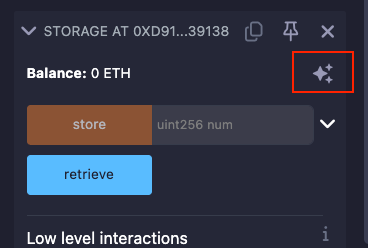
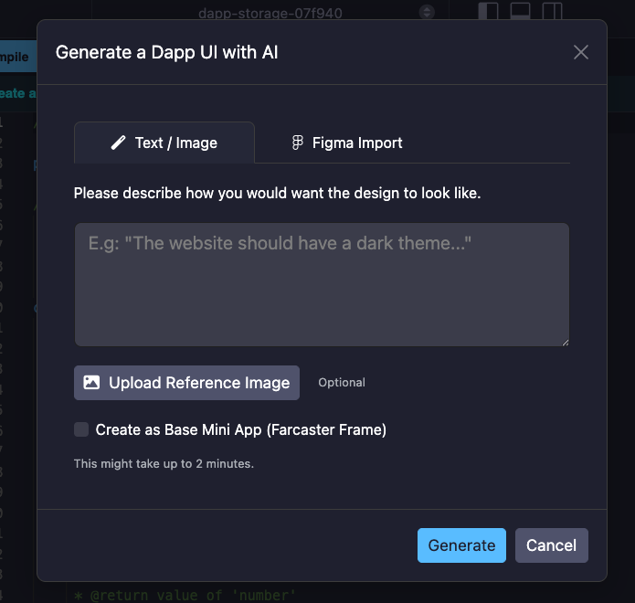
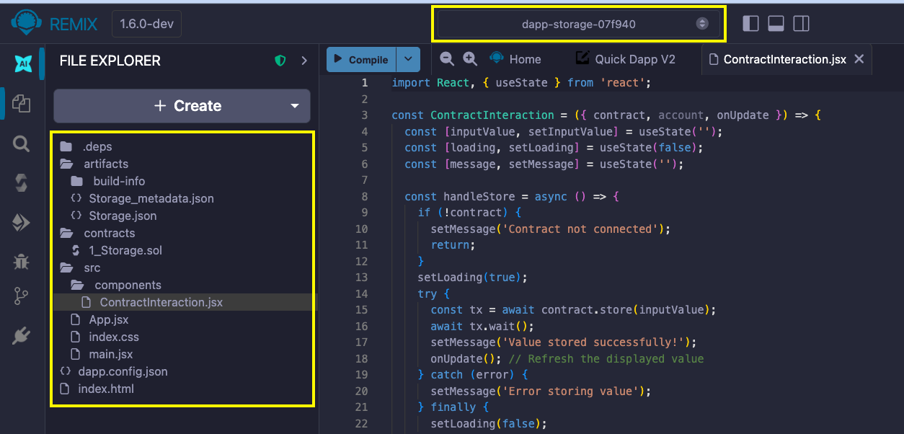
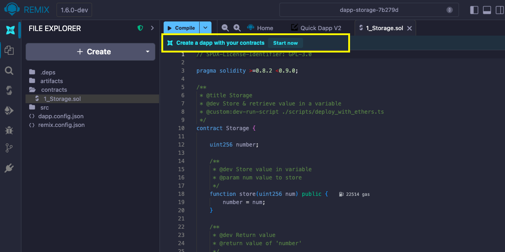
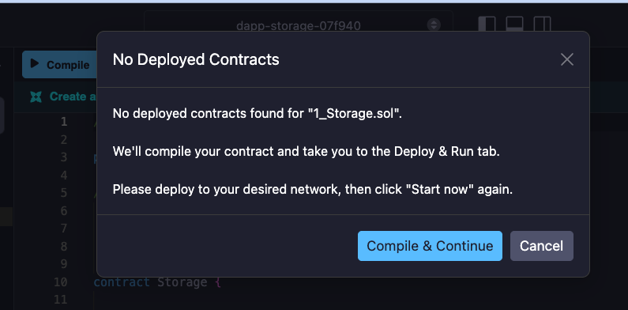

# QuickDapp: Generating UIs for your Contracts

QuickDapp is a feature in Remix IDE that uses AI to generate front-end interfaces for your deployed Solidity contracts. Instead of manually building a UI, you can describe the dApp you want, optionally providing a reference image or Figma design, and QuickDapp will generate a ready-to-use React application in a new workspace. It supports both standard web dApps and Base mini apps (Farcaster Frames).

## Creating a dApp

There are two ways you can create a dApp using QuickDapp:

1. The Deploy and Run plugin.
2. `.sol` files.

### Creating a dApp from Deploy and Run

When you compile and deploy a Solidity contract using the Deploy and Run plugin, a sparkle icon appears on the deployed contract's dropdown.



Click the sparkle icon to open a prompt modal where you can describe what you want the dApp to look like. You can also upload an image for reference to improve the results of the generation.



Alternatively, you can import a design from Figma to give QuickDapp more context to generate your UI from.

By default, QuickDapp generates a standard web dApp built with React, intended for full-featured browser-based interaction with your contract. However, you can generate it as a Base mini app (Farcaster Frame) that runs inside Farcaster by checking the "Create as Base Mini App (Farcaster Frame)" checkbox.

```{warning}
The dApps generated by QuickDapp are designed to work with browser extension wallets like Metamask. Thus, if you deploy your contract on Remix VM or any other non-browser wallet environment, your dApp might not work as expected.

```

After providing all the necessary context for your dApp, click the "**Generate**" button. QuickDapp will create a new workspace where the UI logic will live and redirect you to it.
The dApp generation process may take up to 2 minutes or more.



### Creating a dApp from `.sol` files

When you open a `.sol` file in the Remix IDE, a banner with the label "**Create a dApp with your contract**" will appear at the top of the editor. To create a UI for the open contract, click the "**Start now**" button.



When you click the "**Start now**" button, QuickDapp checks for deployed instances of the open Solidity file. If there are no deployed instances of the contract, you will be prompted to compile and deploy the contract before clicking the "**Start now**" button again.



If there is a single deployment of the contract, QuickDapp will prompt you to confirm that you want to create a dApp with the contract. After your confirmation, QuickDapp will show you the context modal where you can describe your UI and upload an image or Figma file, similar to the Deploy and Run plugin flow.

For cases where more than one deployed instance of the contract exists, you will need to pick the instance you want to create a dApp for before proceeding.


## Generated workspace structure

QuickDapp creates a new workspace named using the pattern `dapp-{contractName}-{id}`. Below is its structure.

```shell
dapp-mytoken-a1b2c3/
├── dapp.config.json
├── src/
├── contracts/
└── preview.png
```

- **dapp.config.json** - Contains the contract address, ABI, and chain ID needed to connect the UI to your deployed contract.
- **src/** - Contains the AI-generated React components, styles, and application logic that make up your dApp's front end.
- **contracts/** - A copy of the Solidity source files used to generate the dApp.
- **preview.png** - A thumbnail screenshot of the dApp, generated automatically when you first preview it.
