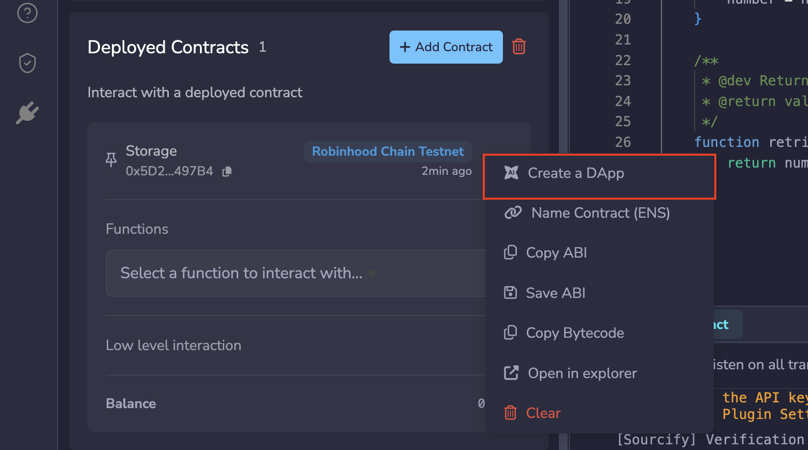
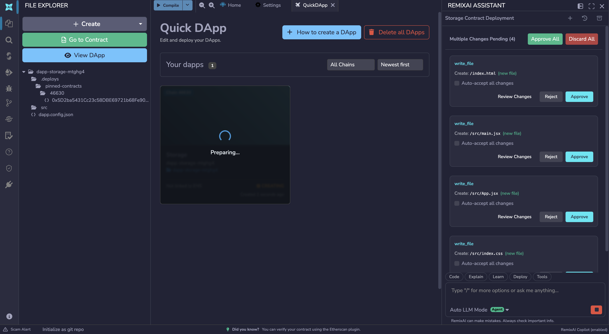
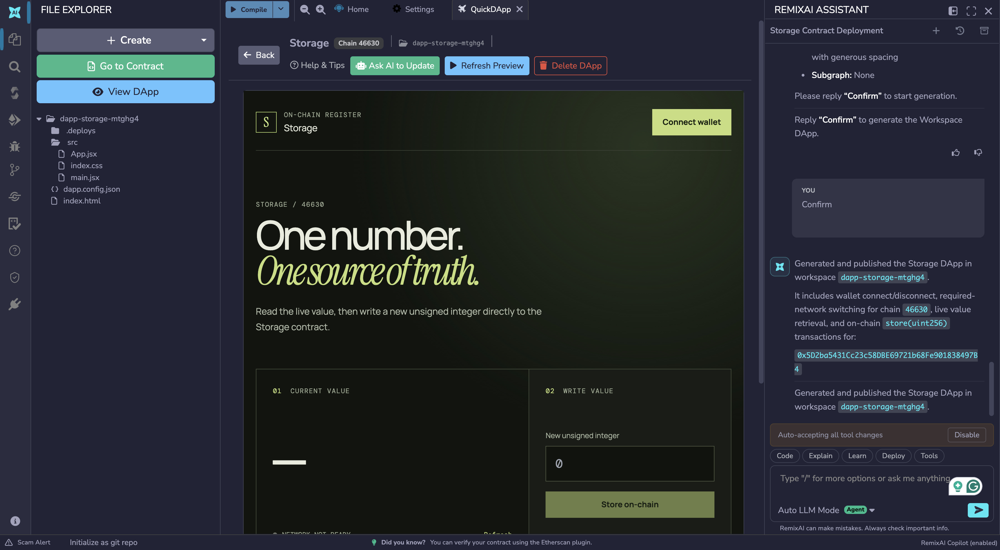
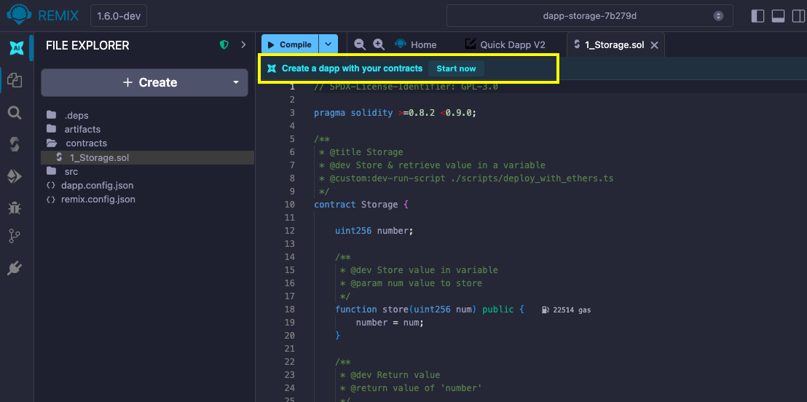
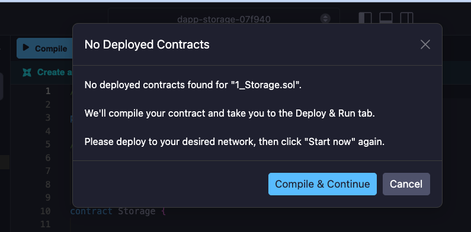
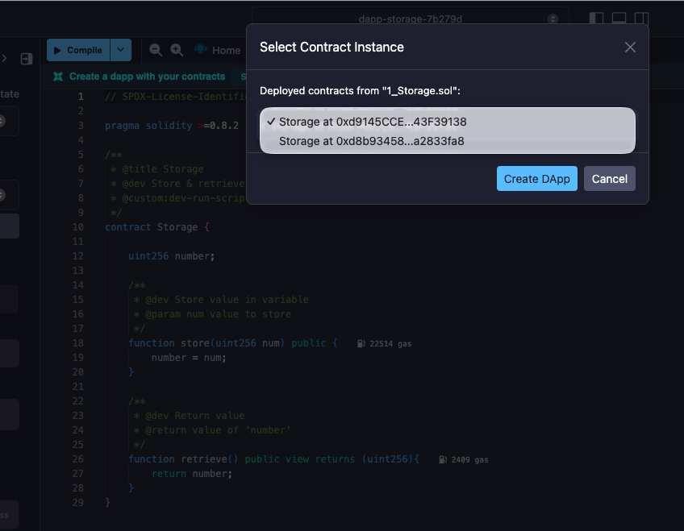
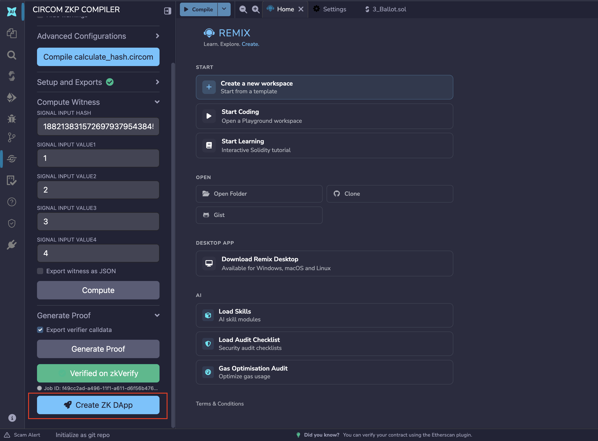
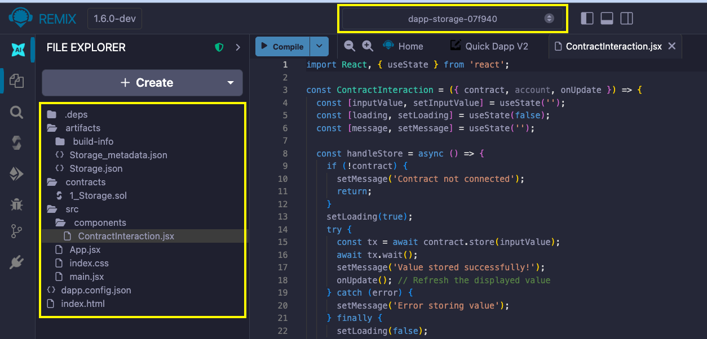

---
myst:
  html_meta:
    "description": "QuickDApp is a Remix IDE feature that uses AI to generate React front-end interfaces for deployed Solidity contracts, supporting standard web dApps and Base mini apps."
    "keywords": "QuickDApp, Remix IDE, Solidity, dApp, AI-generated UI, React, Farcaster Frame, Base mini app, smart contract, front-end"
---

# QuickDApp: Generating UIs for your Contracts

QuickDApp is a feature in Remix IDE that uses AI to generate front-end interfaces for your deployed Solidity contracts. Instead of manually building a UI, you can describe the dApp you want, optionally pointing QuickDApp at a Figma design, and it will generate a ready-to-use React application, either in its own workspace or alongside your contract. It supports both standard web dApps and Base mini apps (Farcaster Frames).

## Creating a dApp

You can create a dApp with QuickDApp from:

1. A deployed contract in the Deploy and Run plugin
2. A `.sol` file
3. A `.subgraph` file or query
4. A Circom circuit (`.circom` file)

```{warning}
The dApps generated by QuickDApp are designed to work with browser extension wallets like Metamask. Thus, if you deploy your contract on Remix VM or any other non-browser wallet environment, your dApp might not work as expected.

```

### Creating a dApp from Deploy and Run

When you compile and deploy a Solidity contract using the Deploy and Run plugin, click the three dots next to the deployed contract and select "Create a DApp"



You will be required to answer the following in the RemixAI Assistant or use the defaults provided:

1. **Location**: Workspace (default) or Inline. Inline keeps the dApp beside your contract, which suits iterating on both, but mixes a React app into your Solidity tree. Workspace gives the dApp its own workspace and switches you to it, keeping it self-contained and easier to export. Use Inline while iterating, Workspace to ship.

2. **Base mini-app**: No (default) or Yes. No generates a standard React web dApp; Yes generates a Base mini app (Farcaster Frame) that runs inside Farcaster. It changes how the project is structured, not just how it looks, so choose correctly the first time.

3. **Design**: Defaults, style notes, or a Figma URL. Defaults give a clean, generic layout. Style notes are free text, so name the colour scheme, light or dark, layout density, and which functions to feature; "make it look nice" gives the AI nothing to act on. Use a Figma URL when you already have a design to match.

4. **Subgraph**: None (default) or a `.subgraph` file path/name. A Subgraph indexes your contract's events, so supplying one lets the dApp show historical data such as past transfers or totals, not just current state. It must index the contract you are generating for. See {doc}`Subgraphs in Remix </subgraph>`.

After providing all the necessary context for your dApp, send the prompt to the RemixAI assistant. It will summarise your answers back to you and ask you to reply **Confirm** to start the generation.

RemixAI then writes the dApp's files, proposing each one for you to approve. You can approve them individually, or use **Approve All** to accept the whole set.



When generation finishes, the dApp opens in the QuickDApp tab with a live preview of the generated UI.



From here you can click **View DApp** to open it, **Refresh Preview** to rebuild the preview, **Go to Contract** to jump back to the contract it was generated from, or **Ask AI to Update** to change the result. **Ask AI to Update** is also where you can upload a reference image and ask the AI to follow it, as there is no image upload among the initial questions.

### Creating a dApp from `.sol` files

When you open a `.sol` file in the Remix IDE, a banner with the label "**Create a dApp with your contract**" will appear at the top of the editor. To create a UI for the open contract, click the "**Start now**" button.



When you click the "**Start now**" button, QuickDApp checks for deployed instances of the open Solidity file. If there are no deployed instances of the contract, you will be prompted to compile and deploy the contract before clicking the "**Start now**" button again.



If there is a single deployment of the contract, QuickDApp will prompt you to confirm that you want to create a dApp with the contract. After your confirmation, RemixAI asks you the same questions described above, and generation proceeds the same way.

For cases where more than one deployed instance of the contract exists, you will need to pick the instance you want to create a dApp for before proceeding.



### Creating a dApp from a `.subgraph` file

You can also generate a dApp from a Subgraph query rather than from a contract. In the File Explorer, right-click a `.subgraph` file and select **Create dApp from Subgraph Query**. See {doc}`Subgraphs in Remix </subgraph>` for the full flow.

### Creating a dApp from a Circom circuit

You can also generate a dApp from a ZK circuit rather than from a contract. Once you have compiled your circuit and generated a proof, click **Create ZK DApp** at the bottom of the Circom plugin panel, below the **Generate Proof** button.



From there, generation proceeds the same way as the other routes. See {doc}`Circom Compiler </circom>` for compiling circuits and generating proofs.

## Generated Workspace structure

When you choose the Workspace location, QuickDApp creates a new workspace named using the pattern `dapp-{contractName}-{id}`. Below is its structure. If you chose Inline instead, these same files are created alongside your contract rather than in a workspace of their own.

```shell
dapp-mytoken-a1b2c3/
├── dapp.config.json
├── src/
├── contracts/
└── preview.png
```



- `dapp.config.json` - Contains the contract address, ABI, and chain ID needed to connect the UI to your deployed contract.
- `src/` - Contains the AI-generated React components, styles, and application logic that make up your dApp's front end.
- `contracts/` - A copy of the Solidity source files used to generate the dApp.
- `preview.png` - A thumbnail screenshot of the dApp, generated automatically when you first preview it.
