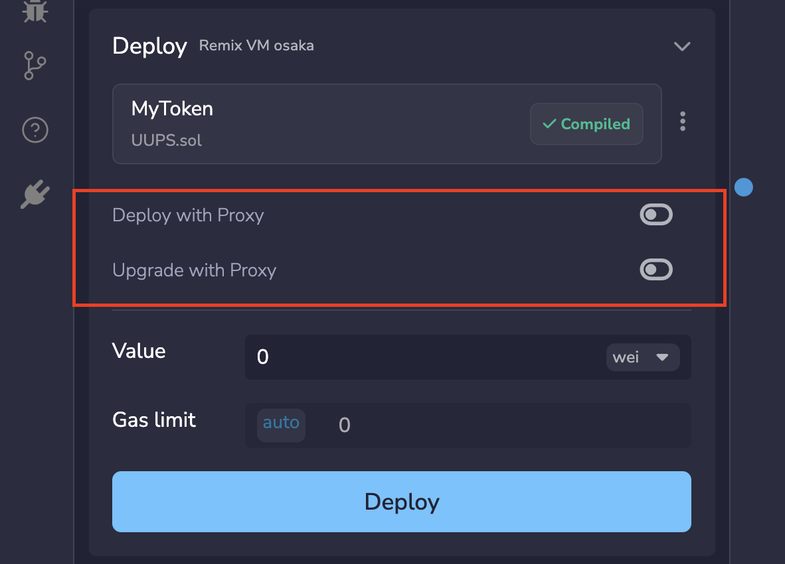
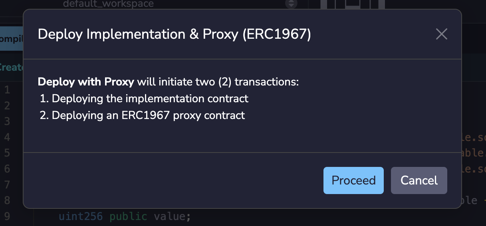
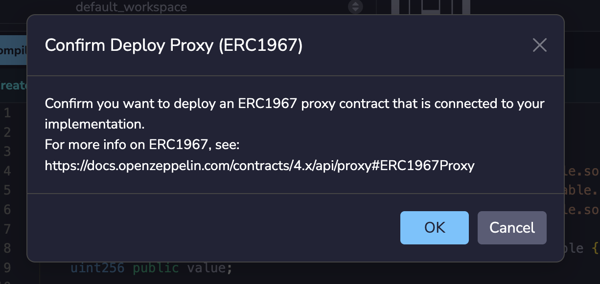
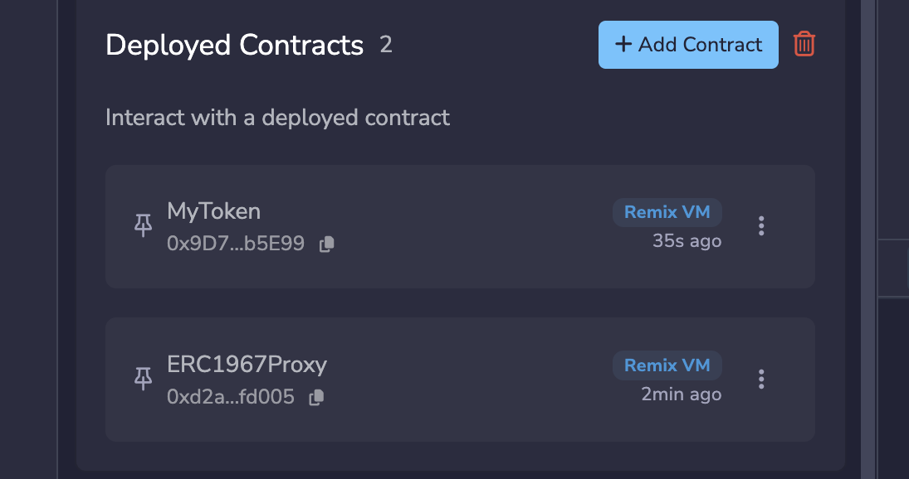
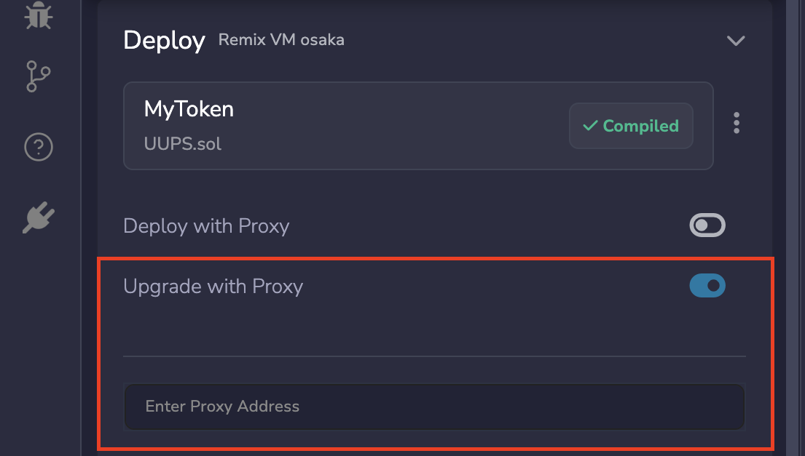

---
myst:
  html_meta:
    "description": "Deploy and manage UUPS proxy contracts in Remix IDE with built-in support for upgradeable smart contract patterns."
    "keywords": "remix proxy contracts, uups, upgradeable contracts, erc1967, remix ide"
---

# Deploy & Run Proxy Contracts

Remix IDE has the functionality to assist in the handling of proxy contracts that use the UUPS pattern.

A UUPS contract is an implementation contract that contains both the business logic and the upgrade mechanism. It is deployed alongside an [ERC1967Proxy](https://eips.ethereum.org/EIPS/eip-1967), which delegates all calls to it.

## Deploying

To try this out, you will need a UUPS contract. Create a new Workspace in Remix and click the Contract Wizard.  In the Wizard's **Upgradeability** section check **UUPS** and in the **Access Control section**, choose **Ownable**.  Then compile it, and open Deploy & Run.

```{note}
UUPS contracts use an `initialize` function instead of a constructor. Call `initialize` via the proxy after deployment to set up initial state. The constructor is intentionally disabled with `_disableInitializers()`.
```

When a UUPS contract is selected in Deploy & Run's Contract dropdown, you'll see some switches below the Deploy button:



Turn on the **Deploy with Proxy** switch. This will create two transactions: one for the implementation (your contract) and the other for the ERC1967 proxy contract. You will get two modals to check through:



and then



If you are deploying to the **Remix VM**, these modals will appear one after the other. If you are connected to the mainnet or a public testnet, then the second modal will appear after the first transaction has gone through.

After the ERC1967 proxy contract is deployed, in the Deployed Contracts section, you'll see two deployed instances.



To interact with your implementation contract **DO NOT** use the instance of your contract. Instead, you should **use the ERC1967 Proxy**. The proxy will have all the functions of your implementation.

## Upgrading

To upgrade, turn on the **Upgrade with Proxy** switch to reveal the address input:



You'll either need to use the last deployed ERC1967 contract, or input the address of the ERC1967 contract that you want to use.

Upgrading deploys your new implementation contract as a separate transaction, then calls `upgradeToAndCall` on the proxy to point it at the new address. Like deploying, this produces two modals: one to confirm the new implementation deployment and one to confirm the upgrade call on the proxy.

```{note}
Your implementation contract must include an `_authorizeUpgrade` function. Without it, the upgrade transaction will revert. OpenZeppelin's UUPS base contract requires you to override this function with access control (typically `onlyOwner`) to prevent unauthorized upgrades.
```

## See also

- [OpenZeppelin Upgrades documentation](https://docs.openzeppelin.com/upgrades-plugins/proxies)
- [ERC-1967 standard](https://eips.ethereum.org/EIPS/eip-1967)
