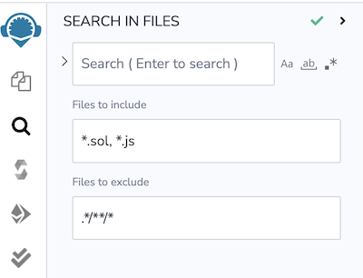
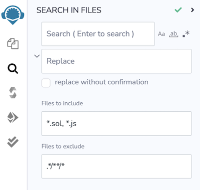

---
myst:
  html_meta:
    "description": "Search and replace text across your Remix IDE workspace files with support for regular expressions."
    "keywords": "remix search, find and replace, search in files, regex, remix ide"
---

# Search in Files

The **Search in Files** plugin is loaded by default. It also includes functionality to search & replace as well as searching with regular expressions.

This plugin searches through text in the files of the current workspace. It does not search across workspaces.

## Search and replace

Clicking on the caret to the left of the text input box will reveal the **replace** functionality.

