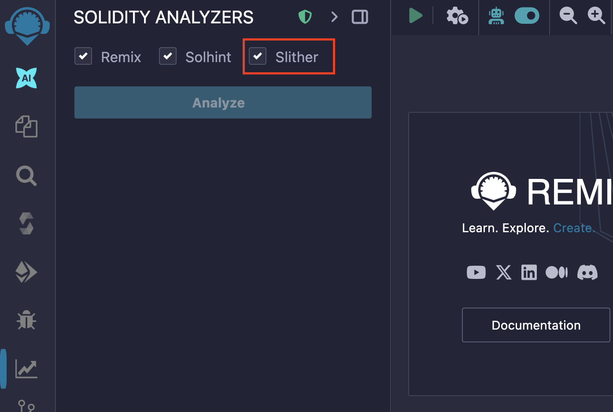

# Slither

[Slither](https://github.com/crytic/slither) is a static analysis framework for Solidity. It runs a suite of vulnerability detectors and provides information about contract details. Slither analysis is available in Remix Desktop through the `Solidity Static Analysis` plugin.

## Prerequisites

To use Slither analysis with Remix IDE efficiently, following tools should be installed locally on your system:

1. **Slither:** [Installing Slither](https://crytic.github.io/slither/slither.html#how-to-install)
2. **Solc:** [Installing Solidity](https://docs.soliditylang.org/en/latest/installing-solidity.html)
3. **Solc-select:** [Solc Quickstart](https://github.com/crytic/solc-select#quickstart)

### How to use

If you load a local project in Remix Desktop, there will be an extra checkbox shown in `Solidity Static Analysis` plugin with the label `Slither` (On Remix Web, this option will be greyed out).

The Slither Analysis report will be displayed on the Slither tab of the Solidity Analyzers plugin, next to the Remix analysis report for better user readability.

The result of the analysis will be shown in the Remix IDE terminal

To only run Slither Analysis, deselect the `Remix` and `Solhint` checkbox and click on "Analyze". Now it will show only the Slither Analysis report.

By default, it doesn't show the warnings for external libraries like remix-tests.sol, hardhat/console.sol etc. To have a look at them, check the box with label `Show warnings for external libraries`.

### More Details

Analysis for Slither is run using the version set in `Solidity Compiler` plugin on Remix IDE. Slither is a CLI tool and requires `solc` to run the analysis. Before running the analysis, Slither WebSocket plugin checks if current version of solc is same as the version set in Remix IDE.

If the compiler version set in Solidity Compiler is different from current version of solc installed locally, the Slither WebSocket plugin will update the `solc` to be the same as the required version `solc-select`.

For example, if current `solc` version on the system is 0.8.4 and on the Remix IDE 0.8.6 is set, the logs explain remote solc version selection.

After successful analysis run:

