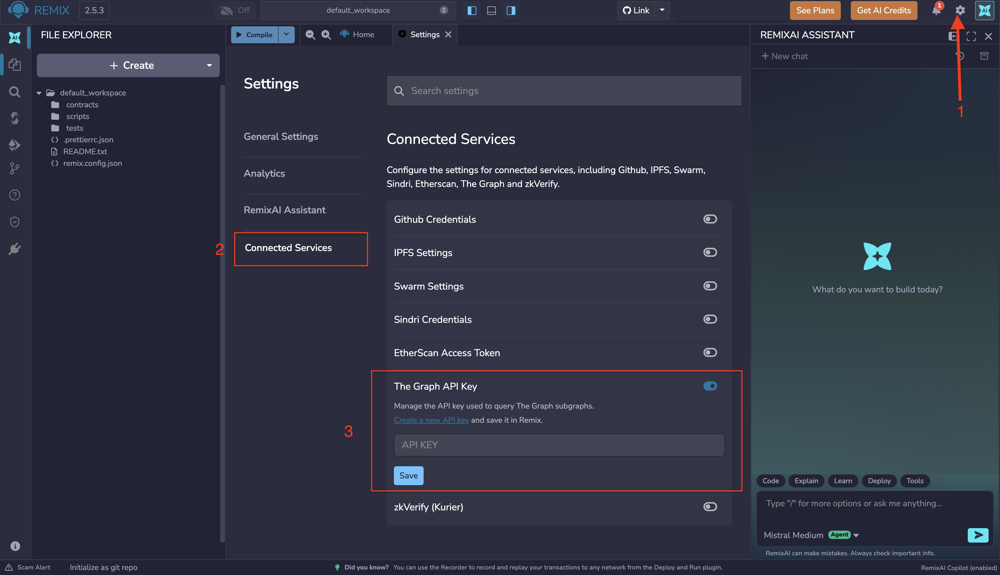
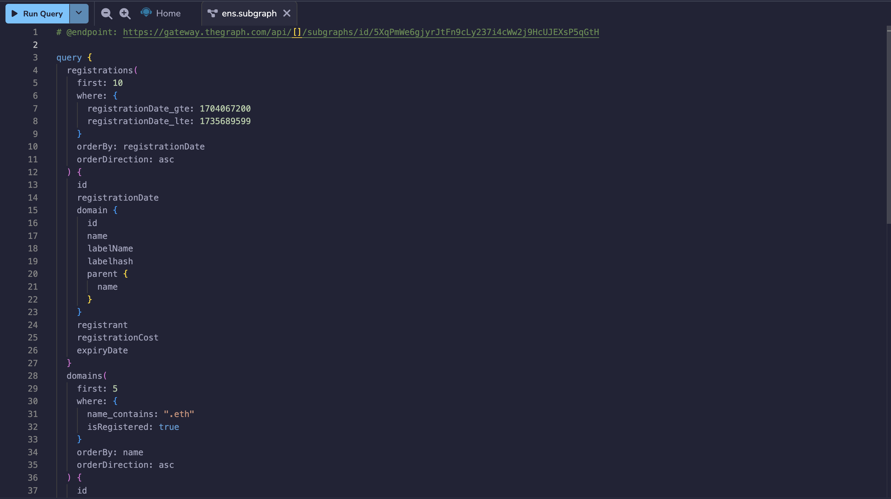
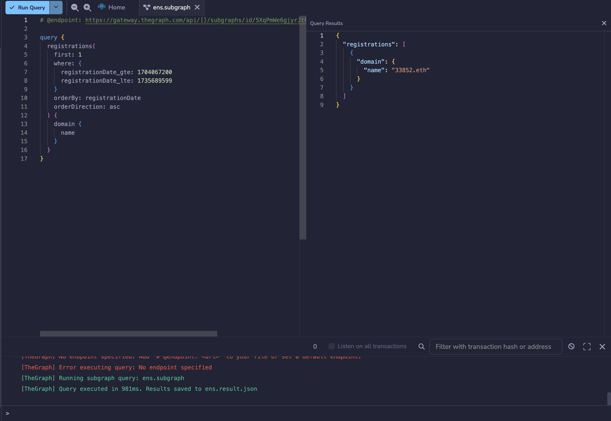
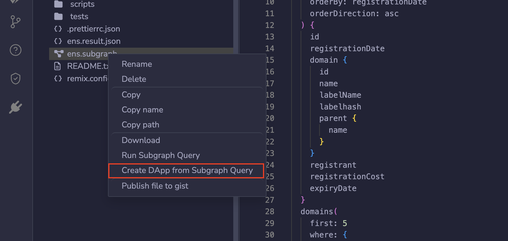

---
myst:
  html_meta:
    "description": "Query subgraphs from The Graph directly in Remix IDE, and scaffold a dApp from your query results."
    "keywords": "subgraph, the graph, graphql, remix ide, remixai, quickdapp"
---

<!-- vale Vale.Terms = NO -->
# Subgraphs in Remix
<!-- vale Vale.Terms = YES -->

Remix has functionality for querying [The Graph](https://thegraph.com)'s subgraphs directly from the Editor, and for scaffolding a dApp from the results of a query. RemixAI can also help you find an existing subgraph and form your queries.

## Configuring your Graph API key

Before you can run a query, you need to add your Graph API key to Remix.

Go to the **Connected Services** section of the **Settings** plugin and paste in your API key.



## Querying a subgraph

When a file in the Editor has a `.subgraph` extension, the **Compile** button becomes the **Run Query** button. Running the query displays the results on the right side of the Editor.



### Try querying a subgraph from Remix

Go to the [Subgraph Explorer](https://thegraph.com/explorer) and search for a subgraph, then paste its query into a file in Remix with a `.subgraph` extension.

Grab the query's endpoint URL and add it to the top of the file as a comment, like this:

```text
# @endpoint: https://gateway.thegraph.com/api/[]/subgraphs/id/5XqPmWe6gjyrJtFn9cLy237i4cWw2j9HcUJEXsP5qGtH
```

Leave the square brackets after `/api/` empty, as shown above, then run the query.



## RemixAI and the Graph

You can ask RemixAI to create a subgraph query for you. For the best results, name the specific contract or protocol you're targeting, the network it's deployed on, and the data you want back (event type, time range, sort order, and so on). The more specific the request, the less editing you'll need to do to the generated `.subgraph` file.

Here's an example prompt:

```text
Create a subgraph query that returns the 10 most recent Transfer events for the USDC contract on Ethereum mainnet, sorted by timestamp.
```

You can also ask RemixAI whether a subgraph already exists for a given contract or protocol, and ask it to help you form your queries against that subgraph. As above, naming the protocol, network, and the metric or data you're after will get you a more usable query on the first try.

Here's an example prompt:

```text
Does a subgraph exist for Uniswap v3 on Ethereum mainnet? If so, help me write a query for the top 5 pools by trading volume over the last 24 hours.
```

<!-- vale Vale.Terms = NO -->
## Subgraph queries for local subgraphs
<!-- vale Vale.Terms = YES -->

For local subgraph development, use [Remix Desktop](https://remix.live/desktop). Because it's a native app, you have access to your machine's terminal, so you can install the Graph CLI and index a subgraph locally. This lets you run queries against data on a local chain, usually Hardhat or Anvil, before your subgraph is deployed anywhere.

Once your local subgraph is indexing, every other flow described on this page (writing `.subgraph` files, setting the endpoint, running queries, and asking RemixAI for help) works exactly the same as it does on Remix Web.

## Making a dApp that queries a subgraph

In the File Explorer, right-click a `.subgraph` file and select **Create dApp from subgraph Query**. Answer RemixAI's questions, and {doc}`QuickDApp </quickdapp>` will launch. From there you can deploy your dApp to IPFS and set up a URL for it.


